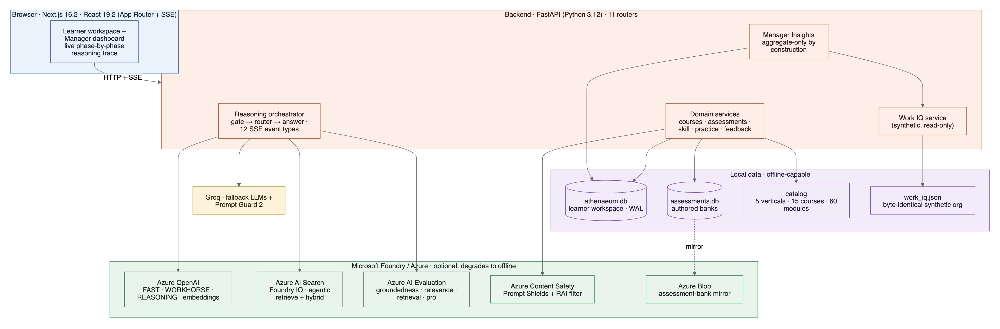
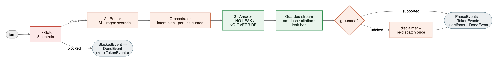
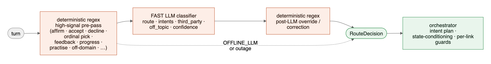
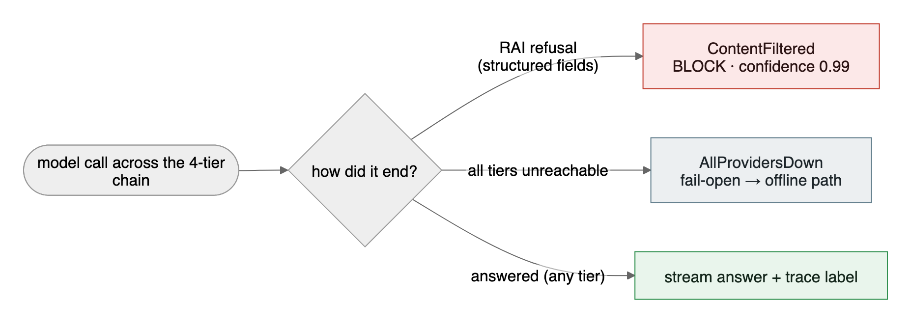
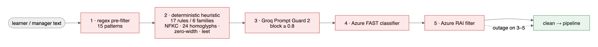
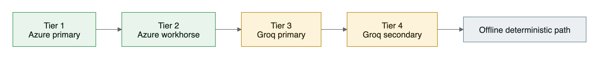
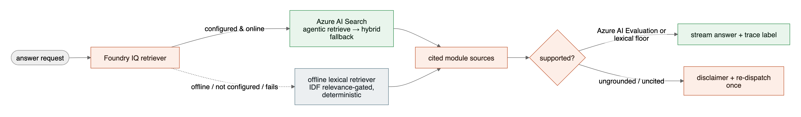
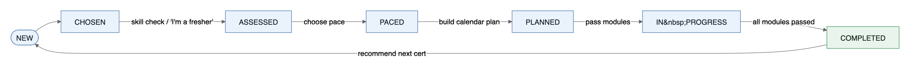
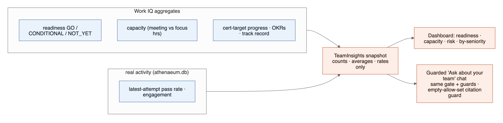
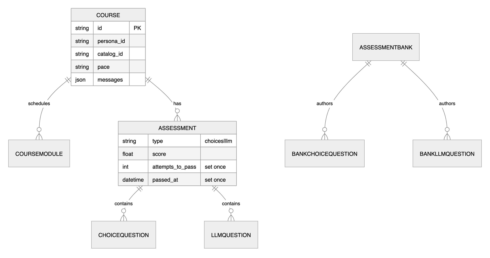

# Architecture diagrams

Exported renders of the 10 Mermaid diagrams embedded in the root [`README.md`](../../README.md).
Each is provided as **SVG** (crisp, scalable — best on GitHub and for print) and **PNG** (2× raster — embeds reliably in slides, PDFs, and submission portals). The root README renders the same diagrams inline via Mermaid; these files are for contexts that don't render Mermaid.

| # | Diagram | README section | What it shows | Files |
|---|---------|----------------|---------------|-------|
| 01 | **System architecture** | §2 | Client · FastAPI backend · optional Microsoft Foundry/Azure column · Groq fallback · offline-capable local data | [svg](01-system-architecture.svg) · [png](01-system-architecture.png) |
| 02 | **Reasoning pipeline** | §3 | The 3-node spine (gate → router → answer) and the 12 typed SSE events, incl. the grounded?/re-dispatch loop | [svg](02-reasoning-pipeline.svg) · [png](02-reasoning-pipeline.png) |
| 03 | **Multi-agent router** | §4 | Online control flow: deterministic regex pre-pass → FAST LLM classifier → regex override → orchestrator intent plan | [svg](03-multi-agent-router.svg) · [png](03-multi-agent-router.png) |
| 04 | **Safety: unsafe ≠ unreachable** | §5 | The signature invariant: `ContentFiltered` → BLOCK at 0.99 vs `AllProvidersDown` → fail-open | [svg](04-safety-unsafe-vs-unreachable.svg) · [png](04-safety-unsafe-vs-unreachable.png) |
| 05 | **Input gate — 5 controls** | §5 | The ordered defense-in-depth gate: regex → heuristic → Prompt Guard 2 → Azure FAST → Azure RAI | [svg](05-input-gate-5-controls.svg) · [png](05-input-gate-5-controls.png) |
| 06 | **Model tier ladder** | §5 | The 4-tier fallback chain: Azure → Azure → Groq → Groq → offline | [svg](06-model-tier-ladder.svg) · [png](06-model-tier-ladder.png) |
| 07 | **Grounding & honesty** | §6 | Foundry IQ (Azure AI Search) vs the offline lexical floor, evaluation, and re-dispatch-once reflection | [svg](07-grounding-and-honesty.svg) · [png](07-grounding-and-honesty.png) |
| 08 | **Learning-domain lifecycle** | §7 | The 7 derived course states from NEW → COMPLETED | [svg](08-learning-domain-lifecycle.svg) · [png](08-learning-domain-lifecycle.png) |
| 09 | **Manager Insights — aggregate-only** | §8 | The data flow that makes per-individual leakage impossible by construction | [svg](09-manager-insights-aggregate-only.svg) · [png](09-manager-insights-aggregate-only.png) |
| 10 | **Data model (ER)** | §9 | The two-SQLite-database schema: learner workspace vs authored banks | [svg](10-data-model-er.svg) · [png](10-data-model-er.png) |

---

### Previews

#### 01 · System architecture

#### 02 · Reasoning pipeline

#### 03 · Multi-agent router

#### 04 · Safety: unsafe ≠ unreachable

#### 05 · Input gate — 5 controls

#### 06 · Model tier ladder

#### 07 · Grounding & honesty

#### 08 · Learning-domain lifecycle

#### 09 · Manager Insights — aggregate-only

#### 10 · Data model (ER)

---

Regenerated from the root README's Mermaid source (Mermaid 11, `neutral` theme, native SVG text labels). If you edit a diagram in the README, re-export to keep these in sync.
